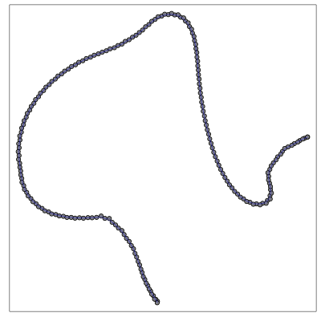
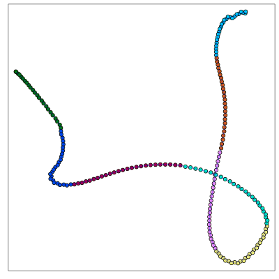
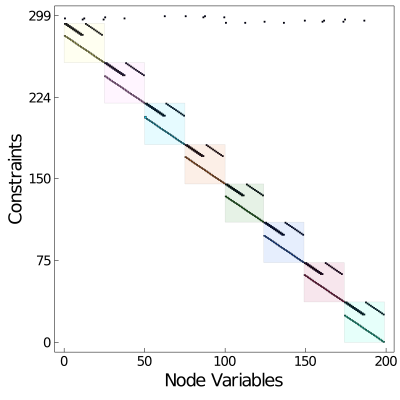
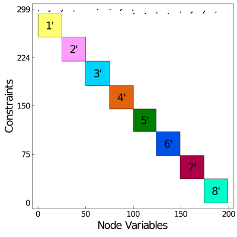

# Graph Processing and Analysis
In [Modeling with OptiGraphs](@ref) we describe how to construct optigraphs using a bottom-up approach that manages problem structure using nodes, edges, and subgraphs.
Plasmo.jl also supports managing optigraphs in a more top-down manner using graph analysis functions and interfaces to standard graph partitioning tools such
as [Metis](https://github.com/JuliaSparse/Metis.jl) and [KaHyPar](https://github.com/kahypar/KaHyPar.jl). 

## Illustrative Example: Dynamic Optimization
To help demonstrate some graph processing capabilities in Plasmo.jl, we construct a simple optimal control problem described by the following equations. In this problem, ``x`` is a vector of states and ``u`` is a vector of control actions which are both indexed over the set of time indices ``t \in \{1,...,T\}``. The objective function minimizes the state trajectory distance from zero with minimal control effort, the second equation describes the
state dynamics, and the third equation defines the initial condition. The last two equations define limits on the state and control actions.

```math
\begin{aligned}
    \min_{\{ x,u \}} & \sum_{t = 1}^T x_t^2 + u_t^2  & \\
    \textrm{s.t.} \quad & x_{t+1} = x_t + u_t + d_t, \quad t \in \{1,...,T-1\}  & \\
    & x_{1} = 0  &\\
    & x_t \ge 0, \quad t \in \{1,...,T\}\\
    & u_t \ge -1000, \quad t \in \{1,...,T-1\}
\end{aligned}
```

This snippet shows how to construct the optimal control problem in Plasmo.jl. We create an optigraph, we add optinodes which contain states and controls at each time period, we setup
objective functions for each node, and we use linking constraints to describe the dynamics (since each node represents a point in time). When we print the newly created optigraph for our optimal control problem, we see it contains about 200 optinodes (one for each state and control) and contains almost 100 linking constraints (which couple the time periods).

```jldoctest optimal_control
using Plasmo

T = 100          # number of time points
d = sin.(1:T)    # disturbance vector (a sin wave)

graph = OptiGraph(;name=:optimal_control)
@optinode(graph, state[1:T])
@optinode(graph, control[1:T-1])

for node in state
    @variable(node, x)
    @constraint(node, x >= 0)
    @objective(node, Min, x^2)
end
for node in control
    @variable(node, u)
    @constraint(node, u >= -1000)
    @objective(node, Min, u^2)
end

@linkconstraint(graph, [i = 1:T-1], state[i+1][:x] == state[i][:x] + control[i][:u] + d[i])
JuMP.fix(state[1][:x], 0)

graph

# output

An OptiGraph
 optimal_control #local elements  #total elements
--------------------------------------------------
          Nodes:       199              199
          Edges:        99               99
      Subgraphs:         0                0
      Variables:       199              199
    Constraints:       299              299

```

We can also plot the resulting optigraph (see [Plotting]) which produces a simple chain of optinodes.

```julia
using PlasmoPlots

plt_chain_layout = layout_plot(
    graph,
    layout_options=Dict(:tol=>0.1,:iterations=>500),
    linealpha = 0.2,
    markersize = 6
)

plt_chain_matrix = matrix_plot(graph)
```

 

## OptiGraph Projections

Plasmo.jl lets us query optigraph properties such as [`all_neighbors`](@ref), [`induced_subgraph`](@ref), and [`incident_edges`](@ref). Before we can 
query any of these properties, we need to create a hypergraph representation of the optigraph using a [`Plasmo.GraphProjection`](@ref). Specifically, we want to 
create a hypergraph projection using [`hyper_projection`](@ref) method.

```jldoctest optimal_control
julia> projection = hyper_projection(graph)
Graph Projection: Plasmo.HyperGraphProjectionType()

```

!!! note

    Plasmo.jl contains a few different [Graph Projections](@ref). The [hypergraph](https://en.wikipedia.org/wiki/Hypergraph) is the most natural representation 
    of an optigraph and is used to perform most processing tasks such as querying neighbors and incident edges. Other projections can be useful for various graph analyses, 
    but no examples exist right now beyond graph partitioning. 

The next most useful projection is probably the [`clique_projection`](@ref). This projection replaces each hyperedge with a set of standard edges to create a standard graph (where edges strictly 
connect 2 nodes). This projection internally contains a `Graphs.SimpleGraph`.

```jldoctest optimal_control
julia> clique_proj = clique_projection(graph)
Graph Projection: Plasmo.CliqueGraphProjectionType()

julia> clique_proj.projected_graph
{199, 297} undirected simple Int64 graph

```

## Querying Topology
Once we have a projection we can run all sorts of methods to query the topology, many of which are extended from [Graphs.jl](https://github.com/JuliaGraphs/Graphs.jl). The below snippet demonstrates some of the primary methods. We first grab two nodes to start some examples. 

```jldoctest optimal_control
julia> node1 = graph[1]
state[1]

julia> node2 = graph[2]
state[2]
```

Remember, `state[2]` is a function of state[1] and control[1] based on our modeled equations. We can query the neighbors of `node1 (state[1])` to confirm this. 
```jldoctest optimal_control
julia> all_neighbors(projection, node1)
2-element Vector{OptiNode{OptiGraph}}:
 state[2]
 control[1]
```

We can query the [`neighborhood`](@ref) around a node within a given distance (this function also returns the queried node). 
For this example we use a distance of 1. We can also query a neighborhood given a set of nodes.
```jldoctest optimal_control
julia> neighborhood(projection, [node1], 1) 
3-element Vector{OptiNode{OptiGraph}}:
 state[1]
 state[2]
 control[1]

julia> neighborhood(projection, [node1, node2], 1)
5-element Vector{OptiNode{OptiGraph}}:
 state[1]
 state[2]
 control[1]
 state[3]
 control[2]

```

We can look at edges incident to a single node or set of nodes.  Note that `state[1]` has one incident edge that connects it to `control[1]` and `state[2]`.
We verify this by using `all_nodes` on the returned edge.
```jldoctest optimal_control
julia> node1_incident = incident_edges(projection, node1) 
1-element Vector{OptiEdge{OptiGraph}}:
 optimal_control.e1

julia> edge1_nodes = all_nodes(node1_incident[1])
3-element Vector{OptiNode}:
 state[2]
 state[1]
 control[1]

julia> incident_edges(projection, [node1,node2])
2-element Vector{OptiEdge{OptiGraph}}:
 optimal_control.e1
 optimal_control.e2

```

We lastly show how to query the edges induced by a set of nodes. These are all edges that connect the 
given nodes.
```jldoctest optimal_control
julia> induced = induced_edges(projection, edge1_nodes)
1-element Vector{OptiEdge}:
 optimal_control.e1

```

## Assembling New OptiGraphs

A key capability that derives from graph topology queries is the ability to create 
new optigraphs from subsets of nodes and edges. This is primarily done with the
`assemble_optigraph`(@ref) method which some topology functions implicity call. Here we show
how to create new optigraphs using some of these methods.

```jldoctest optimal_control
julia> queried_nodes = neighborhood(projection, [node1], 5)
11-element Vector{OptiNode{OptiGraph}}:
 state[1]
 state[2]
 control[1]
 state[3]
 control[2]
 state[4]
 control[3]
 state[5]
 control[4]
 state[6]
 control[5]

julia> queried_edges = induced_edges(projection, queried_nodes)
5-element Vector{OptiEdge}:
 optimal_control.e1
 optimal_control.e2
 optimal_control.e3
 optimal_control.e4
 optimal_control.e5

julia> new_graph = assemble_optigraph(queried_nodes, queried_edges; name=:new_graph)
An OptiGraph
       new_graph #local elements  #total elements
--------------------------------------------------
          Nodes:        11               11
          Edges:         5                5
      Subgraphs:         0                0
      Variables:        11               11
    Constraints:        17               17

```

!!! warning

    You must pass valid nodes and edges to [`assemble_optigraph`](@ref). All of the edges must 
    be connected to the given nodes.

An easy alternative to using [`assemble_optigraph`](@ref) is to use [`induced_subgraph`](@ref) which takes a vector of nodes and does the above operations internally.

```jldoctest optimal_control
julia> new_graph = induced_subgraph(projection, queried_nodes; name=:induced_graph)
An OptiGraph
   induced_graph #local elements  #total elements
--------------------------------------------------
          Nodes:        11               11
          Edges:         5                5
      Subgraphs:         0                0
      Variables:        11               11
    Constraints:        17               17

```

We can lastly [`expand`](@ref) a set of nodes to create a new graph. We can provide either 
a subgraph (an optigraph) or a set of nodes to expand with. This would look like the following:

```jldoctest optimal_control
julia> expanded_graph = expand(projection, new_graph, 1; name=:expanded_graph)
An OptiGraph
  expanded_graph #local elements  #total elements
--------------------------------------------------
          Nodes:        13               13
          Edges:         6                6
      Subgraphs:         0                0
      Variables:        13               13
    Constraints:        20               20

julia> expanded_with_nodes = expand(projection, queried_nodes, 1; name=:expanded_nodes)
An OptiGraph
  expanded_nodes #local elements  #total elements
--------------------------------------------------
          Nodes:        13               13
          Edges:         6                6
      Subgraphs:         0                0
      Variables:        13               13
    Constraints:        20               20

```

## Partitioning OptiGraphs

Plasmo.jl supports partitioning optigraphs wherein partitions of nodes and edges can be used to assemble optigraphs that contain subgraphs. This allows users to reveal and create nested optigraph structures that would be difficult (or impractical) to formulate otherwise. Plasmo.jl takes care of creating new optigraphs given partition information. 

Since the [`OptiGraph`](@ref) is a [hypergraph](https://en.wikipedia.org/wiki/Hypergraph) at its core, it naturally should 
interface to various partitioning tools (both standard and hypergraph partitioning). 
To begin however, we show how to partition an optigraph manually by defining vectors of node partitions. 

We first define our manual partition as a vector of vectors. Each internal vector contains the 
optinodes that correspond to a time interval. In this case, we assemble a vector of 5 time intervals.
Using our vector we can construct a [`Partition`](@ref) object which denotes node and edge partitions and how they are connected.
```jldoctest optimal_control
julia> all_graph_nodes = all_nodes(graph);

julia> node_vectors = [[state[1:20];control[1:20]],[state[21:40];control[21:40]],[state[41:60];control[41:60]],[state[61:80];control[61:80]],[state[81:100];control[81:99]]];

julia> manual_partition = Partition(graph, node_vectors)
OptiGraph Partition w/ 5 subpartitions

```

Once we construct a [`Partition`](@ref), we can assemble a new optigraph from the nodes using [`assemble_optigraph`](@ref).
Notice that the new graph contains few local elements (just the 4 edges that connect the new subgraphs).
```jldoctest optimal_control
julia> new_manual_graph = assemble_optigraph(manual_partition; name=:partitioned_graph)
An OptiGraph
partitioned_graph #local elements  #total elements
--------------------------------------------------
          Nodes:         0              199
          Edges:         4               99
      Subgraphs:         5                5
      Variables:         0              199
    Constraints:         4              299

```

!!! note

    We can also modify an existing graph using [`apply_partition!`](@ref) versus creating a new graph. This can be useful for reducing memory requirements but it keep in mind it fundamentally
    alters the optigraph structure. Also note that this method is somewhat experimental; we suggest using `assemble_optigraph` if performance is not critical.

We now demonstrate how to use the hypergraph partitioning with [KaHyPar.jl](https://github.com/kahypar/KaHyPar.jl) using the [`hyper_projection`](@ref) we created above.
The general workflow is straightforward:
```jldoctest optimal_control
julia> using KaHyPar

julia> using Suppressor # suppress KaHyPar output

julia> partition_vector = @suppress KaHyPar.partition(projection, 8, configuration=:connectivity, imbalance=0.01);

julia> partition_kahypar = Partition(projection, partition_vector)
OptiGraph Partition w/ 8 subpartitions

julia> kahypar_graph = assemble_optigraph(partition_kahypar; name=:kahypar_graph)
An OptiGraph
   kahypar_graph #local elements  #total elements
--------------------------------------------------
          Nodes:         0              199
          Edges:         7               99
      Subgraphs:         8                8
      Variables:         0              199
    Constraints:         7              299

```
In this case, we ended up with a similar partition to the manual one (where instead we ask for 8 partitions as 
KaHyPar makes it easy to do so). In most cases, the best partition is not this obvious.

!!! warning

    KaHyPar does not currently build on Windows. If you are interested in using graph partitioning with Plasmo.jl, read on to see how you can use `Metis`. 

!!! note

    Plasmo.jl contains a direct interface to KaHyPar which is used here. In general, a 
    user can always construct the manual partition vector however they wish and generate 
    a [`Partition`](@ref) object.

As a final example, we show how one might use Metis to partition this optigraph using the 
[`clique_projection`](@ref) presented earlier.

```jldoctest optimal_control
julia> using Metis

julia> clique_proj
Graph Projection: Plasmo.CliqueGraphProjectionType()

julia> simple_graph = clique_proj.projected_graph
{199, 297} undirected simple Int64 graph

julia> metis_vector = Int64.(Metis.partition(simple_graph, 5)); # Plasmo.jl requires Int64 vectors.

julia> partition_metis = Partition(clique_proj, metis_vector)
OptiGraph Partition w/ 5 subpartitions

julia> metis_graph = assemble_optigraph(partition_metis; name=:metis_graph)
An OptiGraph
     metis_graph #local elements  #total elements
--------------------------------------------------
          Nodes:         0              199
          Edges:         4               99
      Subgraphs:         5                5
      Variables:         0              199
    Constraints:         4              299

```

If we plot and of the above partitioned optigraphs, it reveals five distinct partitions and
the coupling between them. The plots show that the partitions are well-balanced and the matrix visualization shows the problem is reordered into a banded structure that is typical of dynamic
optimization problems.

```julia
plt_chain_partition_layout = layout_plot(
    kahypar_graph,
     layout_options=Dict(
        :tol=>0.01,
        :iterations=>500
    ),
    linealpha=0.2,
    markersize=6,
    subgraph_colors=true
)
                                         )

plt_chain_partition_matrix = matrix_layout(kahypar_graph, subgraph_colors=true)

```

 

## Aggregating OptiGraphs (Experimental)

Optigraphs can be converted into stand-alone optinodes using the using the [`aggregate`](@ref) and [`aggregate_to_depth`](@ref) functions. This can be helpful when the user models using optigraphs, but they want to represent subproblems using optinodes. In the snippet below, we aggregate our optigraph that contains 5 subgraphs.  We include the argument `0` which specifies how many subgraph levels to retain.  In this case,
`0` means we aggregate subgraphs at the highest level so `graph` contains only new aggregated optinodes. For hierarchical graphs with many levels,
we can define how many subgraph levels we wish to retain. The function returns a new aggregated graph (`aggregate_graph`), as well as a
`reference_map` which maps elements in `aggregate_graph` to the original optigraph `graph`.

```julia
julia> aggregate_graph, reference_map = aggregate_to_depth(graph, 0; name=:agg_graph);

julia> aggregate_graph
An OptiGraph
       agg_graph #local elements  #total elements
--------------------------------------------------
          Nodes:         8              8
          Edges:         7              7
      Subgraphs:         0              0
      Variables:         199            199
    Constraints:         299            299

```

!!! note

    A user can also use `aggregate!` to permanently aggregate an existing optigraph. This avoids maintaining a copy of the original optigraph.

We can lastly plot the aggregated graph structure which simply shows 8 optinodes with 7 linking constraints.

```julia
plt_chain_aggregate = layout_plot(
    aggregate_graph,
    layout_options=Dict(:tol=>0.01,:iterations=>10),
    node_labels=true,
    markersize=30,
    labelsize=20,
    node_colors=true
);

plt_chain_matrix_aggregate = matrix_plot(
    aggregate_graph,
    node_labels=true,
    node_colors=true
);

```

 


